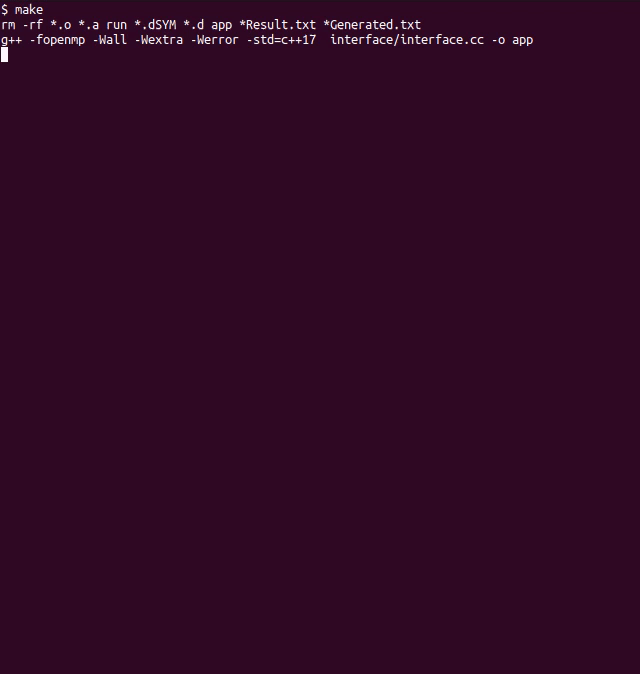

# Решение задачи коммивояжёра с помощью муравьиного алгоритма (ACO)

Этот проект представляет собой реализацию алгоритма ACO для решения задачи коммивояжера. В рамках проекта были реализованы однопоточное и многопоточное решения с целью сравнить прирост скорости выполнения при использовании нескольких потоков.

## Структура проекта

- **src/**
  - **Файлы исходного кода и Makefile** — основной код программы и файл для сборки.
- **aco_test_samples.txt** — примеры графов, заданных матрицами смежности, которые можно использовать для тестирования алгоритма.


## Демонстрация работы

Ниже представлена GIF-анимация, которая демонстрирует работу приложения:



## Инструкция по запуску

Для того чтобы собрать и запустить программу, выполните следующие шаги:

1. **Склонируйте репозиторий** или скачайте его архивом.
2. **Перейдите в директорию с проектом:**

   ```bash
   cd путь/до/проекта/src
   make
   ```

## Зависимости
- **g++** для компиляции С++ (17 стандарт)
- **Make** для сборки